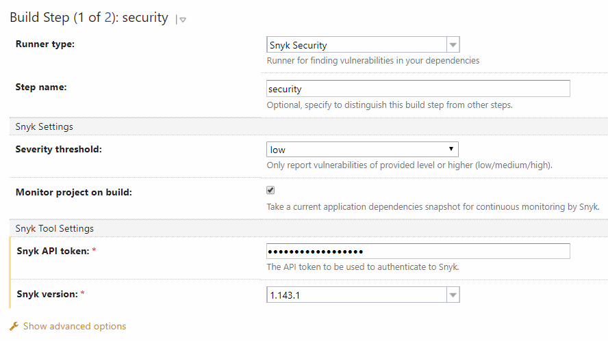

# TeamCity Snyk Security Plugin

Enables TeamCity integration with Snyk and allows users to test their applications against the [Snyk vulnerability database](https://snyk.io/vuln).

## Table of Contents

* [Overview](#overview)
* [Installation](#installation)
* [Usage](#usage)
* [Contributions](#contributions)
* [License](#license)

## Overview

Plugin supports following operations:
* test projects for known vulnerabilities
* take an application dependencies snapshot for continuous monitoring by Snyk.
* create a HTML report displaying the vulnerabilities discovered.

## Installation

You can [download the plugin](https://plugins.jetbrains.com/plugin/12227-snyk-security) and install it as an [additional plugin](https://confluence.jetbrains.com/display/TCDL/Installing+Additional+Plugins) for TeamCity 2018.2+.

## Usage

Add **Snyk Security** step to build configuration and adjust parameters you need

Available configuration parameters:
* **Severity threshold** - Only report vulnerabilities of provided level or higher.
* **Monitor project on build** - Take a current application dependencies snapshot for continuous monitoring by Snyk.
* **File** - The path to the application manifest file to be scanned by Snyk.
* **Organisation** - The Snyk organisation in which this project should be tested and monitored.
* **Project name** - A custom name for the Snyk project created for this TeamCity project on every build.
* **Additional parameters** - Refer to the [Snyk CLI](https://snyk.io/docs/using-snyk/) help page for information on additional parameters.
* **Snyk API token** - The ID for the API token to be used to authenticate with Snyk.
* **Snyk version** - The bundled Snyk CLI version.
* **Custom build tool path** - Specify the path to the build tool used for the project if the checkbox **Use custom build tool path** is selected.
Otherwise, auto-discover mode will be activated.

## Contributions

We appreciate all kinds of feedback, so please feel free to send a PR or submit an issue. Read our [Contributors' Guide](.github/CONTRIBUTING.md) for details.

## License

This project is licensed under the [Apache License, Version 2.0](LICENSE).
